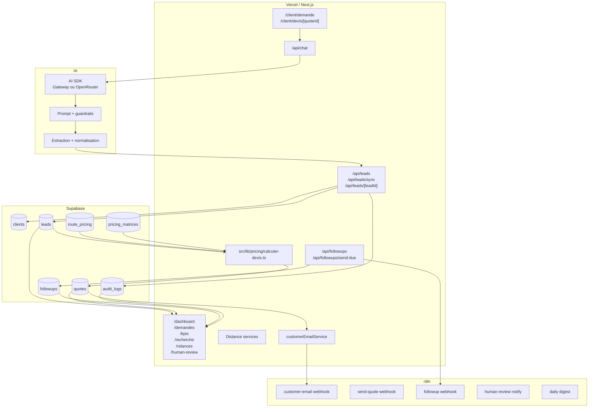
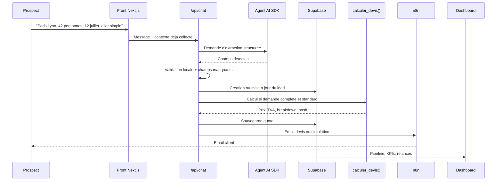
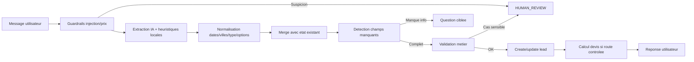
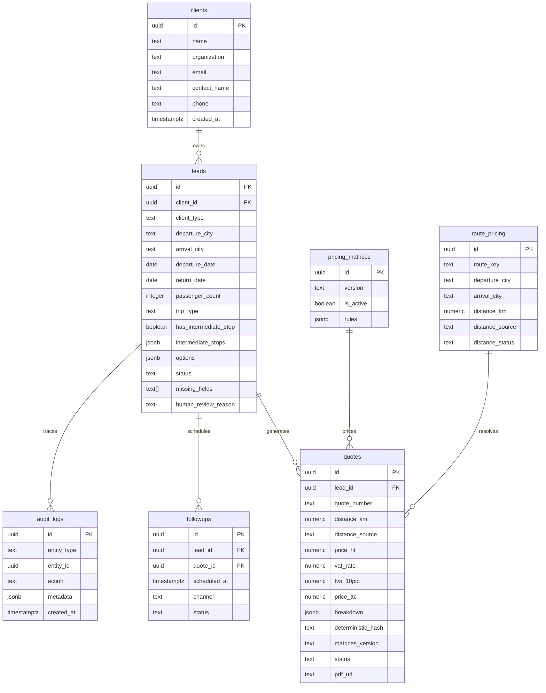
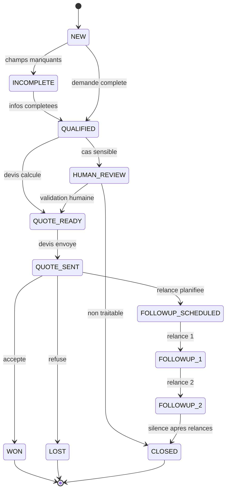

# NeoTravel

Prototype MVP d'automatisation du parcours commercial amont de NeoTravel :
captation prospect, qualification, tarification deterministe, devis, relances et
dashboard de pilotage.

Branche de travail documentee : `last_modif`.
Production cible connue : https://neotravel-epitech.vercel.app
Depot Claudio : https://github.com/Cloud-io09/neotravel-epitech.git

## 1. Vue d'ensemble

NeoTravel est une PME d'intermediation dans le transport de groupe. Le probleme
principal n'est pas l'acquisition : le flux entrant est deja important. La
difficulte est de traiter les leads de maniere rapide, fiable, priorisee et
tracable.

Le MVP couvre le parcours commercial amont :

1. Captation d'une demande prospect.
2. Qualification des informations utiles.
3. Detection des champs manquants.
4. Centralisation dans une base de suivi.
5. Calcul automatique ou semi-automatique du devis.
6. Generation d'une proposition.
7. Envoi ou simulation d'envoi client.
8. Relances programmees.
9. Suivi du pipeline.
10. Reporting des indicateurs commerciaux principaux.

Principe cle : l'IA aide a qualifier et structurer la demande, mais le prix est
toujours calcule par du code deterministe. Les cas complexes sont repris par un
humain.

## 2. Stack technique

| Brique | Choix | Role |
|---|---|---|
| Front/API | Next.js 16 App Router | Pages client, dashboard, routes API |
| UI | React 19, CSS Modules, lucide-react, Leaflet | Interfaces, cartes, composants |
| Langage | TypeScript | Contrats metier, logique applicative |
| Validation | Zod + regles locales | Securisation des entrees/sorties |
| IA | Vercel AI SDK | Qualification et reponses conversationnelles |
| Provider IA | Vercel AI Gateway puis OpenRouter | `AI_GATEWAY_API_KEY` prioritaire, fallback `AI_API_KEY` |
| Base | Supabase | Clients, demandes, devis, relances, logs, pricing |
| Automatisation | n8n | Emails, relances, notifications, jamais le prix |
| Distance | route_pricing + OpenRouteService/OSRM optionnels | Distance controlee, jamais inventee par l'IA |
| Tests | Vitest | Pricing, IA, relances, validation, integration Supabase |
| Deploiement | Vercel | Application web et API |

## 3. Architecture haut niveau

```mermaid
flowchart LR
  Prospect[Prospect] --> Front[Next.js front client]
  Front --> ChatAPI[/API chat/]
  ChatAPI --> Agent[Agent AI SDK]
  Agent --> Rules[Regles locales + Zod]
  Rules --> LeadAPI[/API leads/]
  LeadAPI --> DB[(Supabase)]
  Rules --> QuoteService[Quote service]
  QuoteService --> Distance[route_pricing + ORS/OSRM]
  QuoteService --> Pricing[calculer_devis()]
  Pricing --> Quotes[(quotes)]
  QuoteService --> Email[Templates email]
  Email --> N8N[n8n webhooks]
  N8N --> ClientEmail[Email client / relance]
  DB --> Dashboard[Dashboard NeoTravel]
  Quotes --> Dashboard
  Agent --> Human[HUMAN_REVIEW si cas sensible]
  Human --> Dashboard
```

Lecture : le prospect interagit avec le front. L'agent structure la demande,
mais les donnees critiques passent par les regles locales, Supabase, le moteur
de devis et les workflows n8n.

## 4. Architecture technique complete



## 5. Processus To-Be

```mermaid
flowchart TD
  A[Lead entrant] --> B[Chat ou formulaire NeoTravel]
  B --> C[Extraction des informations]
  C --> D{Champs critiques complets ?}
  D -- Non --> E[Statut INCOMPLETE]
  E --> F[Question de clarification / relance]
  F --> C
  D -- Oui --> G{Cas sensible ?}
  G -- Oui --> H[HUMAN_REVIEW]
  H --> I[Reprise commerciale]
  G -- Non --> J[Resolution distance controlee]
  J --> K{Distance disponible ?}
  K -- Non --> H
  K -- Oui --> L[calculer_devis()]
  L --> M[QUOTE_READY]
  M --> N[Envoi ou simulation n8n]
  N --> O[QUOTE_SENT]
  O --> P[Relances selon urgence]
  P --> Q{Reponse client ?}
  Q -- Accepte --> R[WON]
  Q -- Refuse --> S[LOST]
  Q -- Silence apres relances --> T[CLOSED]
```

## 6. Scenario metier de demonstration



## 7. Flow conversation agent



Important : le chat ne doit pas masquer les regles deterministes. Les corrections
locales, le referentiel ville, les tests de date, passagers et options servent de
garde-fous autour du modele.

## 8. Modele de donnees minimal



## 9. Flow conversion commerciale



Note : `HIGH_VALUE`, `FOLLOWUP_1` et `FOLLOWUP_2` existent dans la branche
`last_modif`. Le contrat technique initial recommandait plutot de garder ces
informations hors statut principal. C'est un ecart connu a traiter dans le
backlog si l'equipe veut durcir le modele.

## 10. Regles metier principales

### 10.0 Regles imposees par le kick-off

Le kick-off impose plusieurs garde-fous qui structurent le projet :

- le prix ne doit jamais etre calcule par le LLM ;
- `calculer_devis()` est la source de verite du montant ;
- l'IA peut qualifier, extraire et choisir un outil, mais le code execute ;
- les cas ambigus, urgents ou hors perimetre doivent passer en reprise humaine ;
- les donnees doivent etre centralisees dans Supabase ou dans le mode demo assume ;
- n8n sert aux automatisations de suivi : emails, relances, notifications ;
- le prototype doit montrer le parcours complet, pas seulement un chatbot ;
- le budget IA doit rester maitrise, avec une enveloppe projet de 15 euros.

Ces regles sont documentees dans `docs/requirements.md`,
`docs/contrat-technique.md`, `docs/prompt-system.md` et le dossier de passation.

### 10.1 Champs critiques avant devis

- email
- ville de depart
- ville d'arrivee
- date de depart
- nombre de passagers
- type de trajet

Sans ces champs, la demande reste `INCOMPLETE` et aucun prix n'est calcule.

### 10.2 Garde-fous Human Review

La reprise humaine est attendue dans les cas suivants :

- passagers `<= 0` ou `> 85`
- date de depart passee ou incoherente
- distance non resolue
- ville inconnue non corrigee avec confiance
- trajet avec escale ou multi-destination non controle
- depart tres urgent inferieur a 48h
- demande hors perimetre
- tentative de contournement des regles ou demande de prix arbitraire

### 10.3 Urgence et relances

- Tres urgent : depart inferieur a 48h -> `HUMAN_REVIEW`.
- Urgent : depart entre 48h et 7 jours -> relance J+2 apres devis envoye.
- Standard : depart au-dela de 7 jours -> relances J+3 et J+7.
- Apres deux relances sans reponse -> `CLOSED` selon l'implementation actuelle.
- En mode demo, `DEMO_FAST_FOLLOWUP=true` permet une relance rapide pour la
  demonstration. Ne pas activer en production.

### 10.4 Prix et distance

- `calculer_devis()` est la seule source de prix.
- Les coefficients, marges, TVA et options controlees viennent du code ou des
  matrices.
- La distance vient de `route_pricing`, d'un provider de distance configure ou
  d'une reprise humaine.
- Le LLM ne doit jamais produire un montant, une distance ou une remise.

## 11. Routes principales

| Route | Usage |
|---|---|
| `/client/demande` | Parcours prospect conversationnel |
| `/client/devis/[quoteId]` | Consultation d'un devis client |
| `/dashboard` | Entree dashboard |
| `/dashboard/demandes` | Liste des demandes |
| `/dashboard/demandes/[leadId]` | Detail d'une demande |
| `/dashboard/demandes/archive` | Archives et demandes non traitables |
| `/dashboard/kpis` | Indicateurs de pilotage |
| `/dashboard/recherche` | Resultats de recherche |
| `/dashboard/human-review` | Reprise humaine |
| `/dashboard/relances` | Relances |
| `/dashboard/connexions` | Etat des integrations |
| `/dashboard/couts-logs` | Logs systeme |
| `/dashboard/couts-ia-admin` | Couts IA |
| `/admin/pricing` | Administration pricing |

## 12. Installation locale

```bash
npm install
npm run dev
```

Ouvrir ensuite :

- http://localhost:3000/client/demande
- http://localhost:3000/dashboard
- http://localhost:3000/dashboard/kpis
- http://localhost:3000/dashboard/connexions

## 13. Variables d'environnement

Copier `.env.example` vers `.env.local`.

| Variable | Usage |
|---|---|
| `NEXT_PUBLIC_SUPABASE_URL` | URL Supabase |
| `NEXT_PUBLIC_SUPABASE_ANON_KEY` | Cle anon Supabase |
| `SUPABASE_SERVICE_ROLE_KEY` | Cle serveur Supabase |
| `NEXT_PUBLIC_DEMO_MODE` | Mode demo si Supabase non active |
| `AI_GATEWAY_API_KEY` | Vercel AI Gateway, prioritaire |
| `AI_GATEWAY_MODEL_ID` | Modele Gateway |
| `AI_API_KEY` | Fallback OpenRouter |
| `AI_MODEL_ID` | Modele OpenRouter |
| `AGENT_DEBUG_LOGS` | Logs agent |
| `AGENT_QUALIFICATION_TIMEOUT_MS` | Timeout qualification |
| `NEXT_PUBLIC_APP_URL` | URL app pour emails/liens |
| `N8N_BASE_URL` | Base n8n optionnelle |
| `N8N_CUSTOMER_EMAIL_WEBHOOK` | Webhook email client |
| `N8N_SEND_QUOTE_WEBHOOK` | Webhook envoi devis |
| `N8N_FOLLOWUP_WEBHOOK` | Webhook relances |
| `N8N_HUMAN_REVIEW_WEBHOOK` | Webhook notification reprise humaine |
| `N8N_DAILY_DIGEST_WEBHOOK` | Webhook digest |
| `N8N_WEBHOOK_SECRET` | Secret partage avec n8n |
| `ORS_API_KEY` / `OPENROUTESERVICE_API_KEY` | OpenRouteService |
| `OSRM_BASE_URL` | OSRM optionnel |
| `DISTANCE_PROVIDER` | `hybrid` par defaut |

## 13.1 Connexions API et etat prod

Les connexions se verifient dans le dashboard via `/dashboard/connexions`.

| Connexion | Variables | Comportement attendu |
|---|---|---|
| Supabase | `NEXT_PUBLIC_SUPABASE_URL`, `NEXT_PUBLIC_SUPABASE_ANON_KEY`, `SUPABASE_SERVICE_ROLE_KEY` | Donnees persistantes clients, leads, devis, relances, logs |
| IA via Vercel AI Gateway | `AI_GATEWAY_API_KEY`, `AI_GATEWAY_MODEL_ID` | Provider prioritaire pour l'agent conversationnel |
| IA via OpenRouter | `AI_API_KEY`, `AI_MODEL_ID` | Fallback si Gateway non configure |
| n8n | `N8N_*_WEBHOOK`, `N8N_WEBHOOK_SECRET` | Emails, devis, relances, notifications |
| Distance | `ORS_API_KEY`, `OPENROUTESERVICE_API_KEY`, `OSRM_BASE_URL` | Distance controlee, jamais par le LLM |
| Vercel | Variables d'environnement projet | Deploiement prod et previews |

Dans le code actuel, `src/lib/ai/provider.ts` donne la priorite a Vercel AI
Gateway. Si `AI_GATEWAY_API_KEY` est absent, l'application utilise OpenRouter via
`AI_API_KEY`. Si aucune cle n'est disponible, le chat bascule sur les reponses de
secours et l'extraction deterministe disponible.

## 13.2 Choix IA, Mistral et budget 15 euros

Le choix IA doit etre argumente par rapport au kick-off : cout, qualite,
latence, sorties structurees, compatibilite avec la stack et limites observees.

Choix recommande pour la soutenance :

- **orchestration applicative** : Vercel AI SDK dans Next.js ;
- **provider prioritaire** : Vercel AI Gateway via `AI_GATEWAY_API_KEY` ;
- **modele cible possible** : Mistral via Gateway si disponible dans le compte
  Vercel, ou modele compatible configure dans `AI_GATEWAY_MODEL_ID` ;
- **fallback technique** : OpenRouter via `AI_API_KEY` et `AI_MODEL_ID` ;
- **limite budgetaire** : enveloppe IA projet de 15 euros, a suivre depuis le
  provider utilise.

Le projet ne doit pas promettre un cout fixe non verifie dans le code. Les couts
dependent du modele configure, du nombre de tokens et du provider actif. En
pratique, pour rester sous 15 euros :

- limiter les prompts systeme longs ;
- ne pas envoyer de documents complets au modele ;
- privilegier l'extraction structuree courte ;
- utiliser les regles locales avant d'appeler l'IA quand c'est possible ;
- conserver `AGENT_QUALIFICATION_TIMEOUT_MS` raisonnable ;
- journaliser les erreurs sans stocker le contenu sensible complet ;
- verifier les couts dans Vercel / Gateway ou le provider choisi avant la demo.

Point important pour le jury : le cout IA ne porte pas le devis. Meme si le
modele change, le prix reste produit par `calculer_devis()`.

## 14. Supabase

En local avec Supabase CLI et Docker :

```bash
supabase start
supabase db reset
```

La CLI applique `supabase/migrations/` et `supabase/seed.sql`.

Avec Supabase Cloud :

1. Executer `supabase/schema.sql`.
2. Executer `supabase/seed.sql`.
3. Renseigner les variables Vercel/Supabase.
4. Verifier `/dashboard/connexions`.

## 15. n8n

Workflows fournis :

- `docs/n8n/neotravel-customer-email.workflow.json`
- `docs/n8n/neotravel-relances.workflow.json`

Mode reel :

1. Importer les workflows dans n8n.
2. Configurer `N8N_WEBHOOK_SECRET`.
3. Activer les workflows.
4. Copier les URLs de production dans les variables `N8N_*_WEBHOOK`.

Mode simulation :

- Si aucun webhook n'est configure, l'application renvoie un resultat simule.
- Ce comportement est utile en demo et evite les erreurs reseau.

## 16. Tests et validation

```bash
npm run typecheck
npm test
npm run build
```

Test d'integration Supabase local :

```bash
supabase start
supabase db reset
set -a; eval "$(supabase status -o env)"; set +a
npm run test:integration
```

Scenarios minimaux :

- demande complete Paris -> Lyon ;
- demande incomplete ;
- tentative de prompt injection ;
- 0 passager ;
- 95 passagers ;
- date passee ;
- route inconnue ;
- trajet avec escale ;
- relances standard et urgente ;
- recherche dashboard ;
- archivage avec raison ;
- KPIs visibles.

## 17. Structure du code

| Chemin | Role |
|---|---|
| `src/app/api/chat/route.ts` | Route conversationnelle |
| `src/features/demand/components/DemandConversation.tsx` | UI demande prospect |
| `src/lib/ai/*` | Extraction, provider, prompts, merge, reponses |
| `src/lib/pricing/calculer-devis.ts` | Moteur de calcul deterministe |
| `src/lib/pricing/resolve-distance.ts` | Distance controlee |
| `src/features/emails/services/customerEmailService.ts` | Emails et payloads n8n |
| `src/features/followups/services/scheduleFollowups.ts` | Relances |
| `src/features/dashboard/components/DashboardViews.tsx` | Pipeline et KPIs |
| `src/features/dashboard/components/DashboardSearchResultsPage.tsx` | Recherche |
| `src/features/lead-detail/components/LeadEditForm.tsx` | Edition demande |
| `src/features/lead-detail/components/LeadArchiveAction.tsx` | Archivage |
| `src/lib/domain/status.ts` | Statuts de lead |
| `supabase/schema.sql` | Schema minimal |
| `supabase/migrations/` | Evolutions de schema |
| `docs/contrat-technique.md` | Contrat technique cible |
| `docs/requirements.md` | Exigences et schemas de cadrage |
| `docs/golden-set.md` | Scenarios de validation |

## 18. Documentation livrable

- `docs/requirements.md` : exigences, architecture, schemas et flows.
- `docs/contrat-technique.md` : contrat technique source de verite.
- `docs/prompt-system.md` : regles de prompt et garde-fous.
- `docs/golden-set.md` : scenarios de validation.
- `docs/n8n/README.md` : import et configuration n8n.
- `docs/NeoTravel_L3_Documentation_Passation_last_modif.docx` :
  documentation de passation Word pour remise.

## 19. Points de vigilance

- Le `main` de Claudio et `last_modif` partagent le socle technique, mais
  `last_modif` ajoute KPIs, recherche, archive, coordonnees client, relances
  ajustees et multi-destination.
- Ne jamais modifier le `main` directement pour les travaux Yves.
- Garder le prix dans `calculer_devis()`.
- Garder les secrets hors Git.
- Documenter tout changement de statut, pricing ou relance.
- Verifier la prod sur `/dashboard/connexions` avant soutenance.
