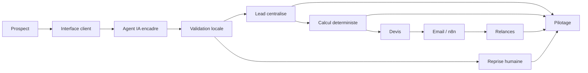
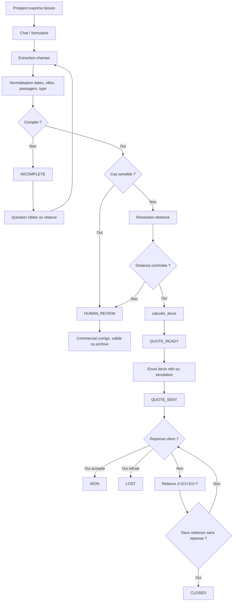
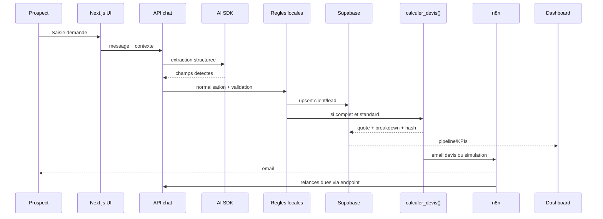
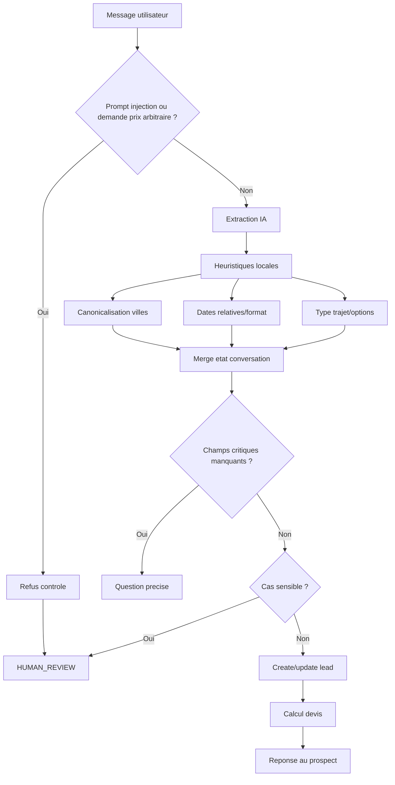
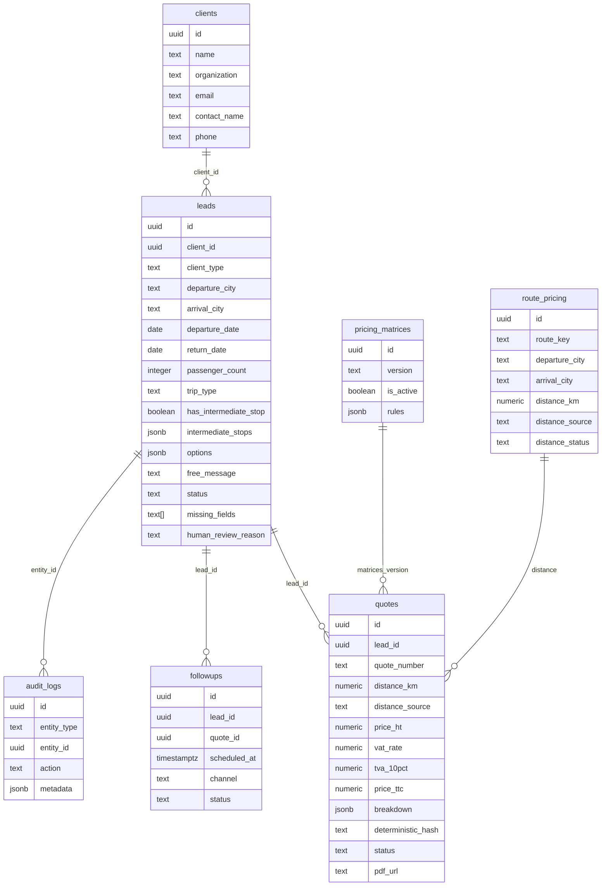
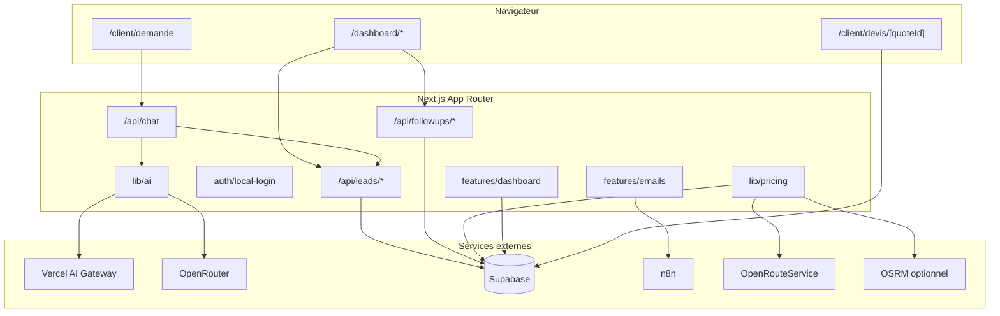
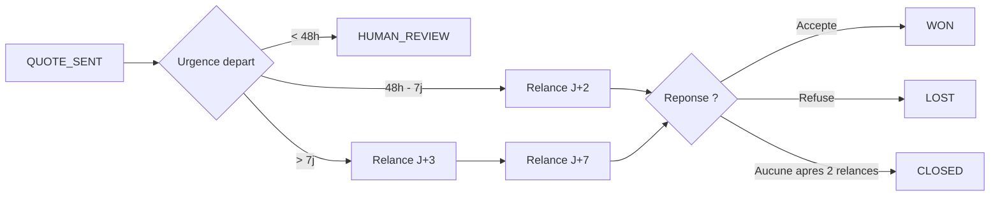

# NeoTravel - Requirements, architecture et schemas

Ce document formalise les exigences et les schemas du MVP NeoTravel sur la base
du cadrage, du `main` Claudio et de la branche `last_modif`.

## 1. Objectifs metier

NeoTravel doit mieux exploiter son flux de leads entrants sans remplacer le role
des commerciaux. Le MVP doit prouver une chaine commerciale automatisee mais
controlee :

- capter les demandes ;
- qualifier les informations ;
- detecter les champs manquants ;
- calculer un devis deterministe ;
- envoyer ou simuler l'envoi client ;
- relancer ;
- piloter les KPIs ;
- escalader les cas complexes.

## 2. Exigences fonctionnelles

| ID | Exigence | Priorite | Etat last_modif |
|---|---|---|---|
| F1 | Captation d'un lead via interface web | P1 | Couverte |
| F2 | Qualification automatique ou semi-automatique | P1 | Couverte |
| F3 | Detection des informations manquantes | P1 | Couverte |
| F4 | Centralisation dans Supabase ou demoStore | P1 | Couverte |
| F5 | Calcul devis par moteur deterministe | P1 | Couverte |
| F6 | Generation de proposition/devis | P1 | Couverte |
| F7 | Envoi ou simulation d'envoi | P1 | Couverte |
| F8 | Relances client | P1 | Couverte |
| F9 | Suivi pipeline commercial | P1 | Couverte |
| F10 | Reporting KPI minimum | P1 | Couverte |
| F11 | Archivage avec raison | P2 | Ajoute dans last_modif |
| F12 | Recherche dashboard dediee | P2 | Ajoute dans last_modif |
| F13 | Multi-destination | P2 | Detection/edition, devis prudent |
| F14 | Verification ville/faute | P2 | Partielle, a renforcer |

## 3. Exigences non fonctionnelles

| ID | Exigence | Decision |
|---|---|---|
| NF1 | Prix explicable et reproductible | `calculer_devis()` uniquement |
| NF2 | IA encadree | Agent limite a extraction/qualification/orchestration |
| NF3 | Donnees tracees | `audit_logs` et statuts |
| NF4 | Secrets hors repo | `.env.local`, Vercel env, Supabase/n8n secrets |
| NF5 | Demo possible sans services externes | demoStore + envois simules |
| NF6 | Reprise humaine | `HUMAN_REVIEW` pour cas sensibles |
| NF7 | Prod connectee | Variables Vercel/Supabase/IA/n8n/ORS a verifier |
| NF8 | Budget IA | Rester dans l'enveloppe projet de 15 euros |
| NF9 | Choix modele justifie | Argumenter cout, qualite, latence, sorties structurees, compatibilite et limites |

## 3.1 Contraintes imposees par le kick-off

Le kick-off impose les regles suivantes :

- le LLM ne calcule jamais le prix ;
- le code deterministe calcule le devis via `calculer_devis()` ;
- l'agent peut decider quel outil appeler, mais les outils executent ;
- n8n sert a l'automatisation commerciale, pas au calcul tarifaire ;
- les cas complexes sont repris par un humain ;
- le prototype doit couvrir la chaine de captation a pilotage ;
- les KPIs minimum doivent etre visibles ;
- l'equipe doit justifier son choix de modele IA ;
- le credit IA doit rester maitrise dans la limite de 15 euros.

Ces contraintes sont non negociables dans la demonstration : changer de modele IA
ne doit pas changer le prix, la distance ou les statuts critiques.

## 3.2 Choix IA, Vercel et budget

Le projet suit l'option B du cadrage technique : l'agent vit dans le code Next.js
via le Vercel AI SDK. n8n reste le dos d'automatisation pour les emails et
relances.

| Sujet | Decision documentaire |
|---|---|
| Orchestration | Vercel AI SDK dans Next.js |
| Provider prioritaire | Vercel AI Gateway via `AI_GATEWAY_API_KEY` |
| Modele cible possible | Mistral via Gateway si configure dans `AI_GATEWAY_MODEL_ID` |
| Fallback | OpenRouter via `AI_API_KEY` et `AI_MODEL_ID` |
| Budget | 15 euros maximum pour l'enveloppe IA projet |
| Regle critique | Le modele ne produit jamais le prix |

Le code actuel ne fixe pas Mistral en dur. Il lit `AI_GATEWAY_MODEL_ID` ou
`AI_MODEL_ID`. Si l'equipe veut defendre Mistral, il faut configurer le modele
correspondant dans Vercel AI Gateway et verifier le cout dans l'interface du
provider. Si un autre modele est configure, la documentation doit mentionner le
modele reel utilise en production.

### Maitrise du cout IA

Pour rester dans l'enveloppe de 15 euros :

- limiter les appels IA aux tours utiles ;
- utiliser les heuristiques locales avant l'appel modele ;
- ne jamais envoyer de donnees inutiles ou de documents entiers ;
- garder les sorties courtes et structurees ;
- surveiller les logs et le dashboard couts IA ;
- tester en local/demo avant de multiplier les essais en prod ;
- expliquer que les calculs metier lourds sont faits par le code, pas par tokens.

Le choix Mistral peut etre defendu si le modele configure presente un bon
equilibre cout/latence/qualite pour de l'extraction en francais. La limite a
assumer : l'extraction IA peut se tromper, donc le projet conserve des garde-fous
locaux et `HUMAN_REVIEW`.

## 4. Vue d'ensemble haut niveau



## 5. Processus To-Be complet



## 6. Schema scenario de bout en bout



## 7. Flow conversion agent



## 8. Modele de donnees minimal



## 9. Schema technique complet



## 10. Schema relances



## 11. Schema de decision devis

```mermaid
flowchart TD
  Lead[Lead] --> Complete{Champs critiques presents ?}
  Complete -- Non --> Incomplete[INCOMPLETE]
  Complete -- Oui --> Capacity{Passagers valides <= 85 ?}
  Capacity -- Non --> Review[HUMAN_REVIEW]
  Capacity -- Oui --> Date{Date valide et future ?}
  Date -- Non --> Review
  Date -- Oui --> Multi{Escale ou multi-destination ?}
  Multi -- Oui --> Review
  Multi -- Non --> Route{Distance controlee ?}
  Route -- Non --> Review
  Route -- Oui --> Calc[calculer_devis()]
  Calc --> Ready[QUOTE_READY]
```

## 12. Variables de production attendues

| Domaine | Variables |
|---|---|
| Supabase | `NEXT_PUBLIC_SUPABASE_URL`, `NEXT_PUBLIC_SUPABASE_ANON_KEY`, `SUPABASE_SERVICE_ROLE_KEY` |
| IA | `AI_GATEWAY_API_KEY`, `AI_GATEWAY_MODEL_ID`, `AI_API_KEY`, `AI_MODEL_ID` |
| n8n | `N8N_BASE_URL`, `N8N_WEBHOOK_SECRET`, `N8N_CUSTOMER_EMAIL_WEBHOOK`, `N8N_SEND_QUOTE_WEBHOOK`, `N8N_FOLLOWUP_WEBHOOK`, `N8N_HUMAN_REVIEW_WEBHOOK`, `N8N_DAILY_DIGEST_WEBHOOK` |
| Distance | `ORS_API_KEY`, `OPENROUTESERVICE_API_KEY`, `OSRM_BASE_URL`, `DISTANCE_PROVIDER` |
| App | `NEXT_PUBLIC_APP_URL`, `NEXT_PUBLIC_DEMO_MODE`, `LOCAL_AUTH`, `NEXT_PUBLIC_LOCAL_AUTH` |

## 13. Definition de "connecte"

Pour la soutenance, on considere la prod connectee si :

- `/dashboard/connexions` indique Supabase configure hors demo ;
- une cle IA est presente (`AI_GATEWAY_API_KEY` ou `AI_API_KEY`) ;
- au moins un webhook n8n est configure ou le mode simulation est explique ;
- la distance dispose d'une source controlee (`route_pricing`, ORS ou OSRM) ;
- les tests de devis montrent que le prix vient du code, pas du LLM.

## 14. Ecarts connus et backlog associe

| Ecart | Impact | Action |
|---|---|---|
| Statuts `HIGH_VALUE`, `FOLLOWUP_1`, `FOLLOWUP_2` presents alors que le contrat initial les evitait | Reporting et coherence pipeline | P1/P2 : rationaliser statuts ou documenter officiellement |
| Multi-destination prudent en `HUMAN_REVIEW` | Moins d'automatisation sur escales | P2 : pricing multi-segment |
| Ville/faute partiellement locale | Risque de mauvaise ville | P1 : enrichir referentiel et tests |
| n8n peut etre simule | Demo acceptable, prod a prouver | P1 : verifier webhooks prod |
| Distance selon plusieurs providers/env vars | Configuration a clarifier | P1 : garder ORS + OPENROUTESERVICE ou unifier |

## 15. Criteres d'acceptation

- Un prospect peut creer une demande.
- Le systeme demande les informations manquantes.
- Un devis standard est calcule par `calculer_devis()`.
- Un cas sensible est bloque en `HUMAN_REVIEW`.
- Les relances sont visibles.
- Les KPIs minimum sont visibles.
- Une demande non traitable peut etre archivee avec raison.
- Le dashboard permet de retrouver une demande via recherche.
- Le projet peut etre lance localement et deployee sur Vercel.
